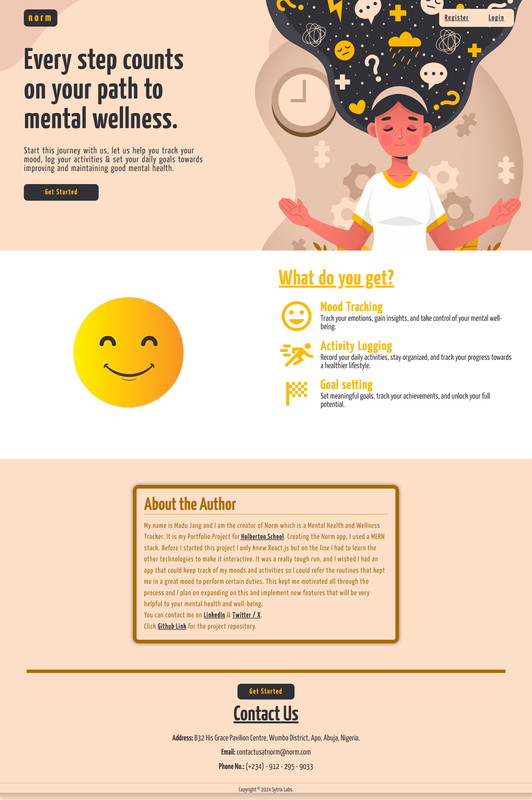

# Norm: Mental Health and Wellness Tracker (by Madu Jang)

## Introduction
Norm is a simple mental health and wellness tracker designed to help individuals improve their well-being through Mood Tracking, Activity Logging, and Goal Setting.

### Links
- **Deployed Site:** [Norm App](https://norm-gy40.onrender.com)
- **Final Project Blog Article:** [A Journey to Mental Wellness](https://medium.com/@madu.jang93/norm-a-journey-to-mental-wellness-155dc49fed94)
- **Author's LinkedIn:** [Madu Jang](https://www.linkedin.com/in/madu-jang/)

## Screenshot


## Installation

1. Clone the repository
    ```bash
    git clone https://github.com/MJspitta/Mental_Health_and_Wellness_Tracker.git
    cd Mental_Health_and_Wellness_Tracker
    ```

2. Install backend dependencies
    ```bash
    cd backend
    npm install
    ```

3. Install frontend dependencies
    ```bash
    cd ../frontend
    npm install
    ```

4. Create a `.env` file in the `backend` directory with the following content:
    ```
    MONGO_URI=your_mongo_uri
    SECRET=your_jwt_secret
    PORT=4000
    ```

5. Run the backend server
    ```bash
    cd backend
    npm start
    ```

6. Run the frontend server
    ```bash
    cd ../frontend
    npm start
    ```

## Usage

1. Open your browser and navigate to `http://localhost:3000`.
2. Sign up for an account or log in if you already have one.
3. Start tracking your mood, logging activities, and setting goals.

## Contributing

We welcome contributions to enhance Norm. To contribute:

1. Fork the repository.
2. Create a new branch:
    ```bash
    git checkout -b feature-branch
    ```
3. Make your changes and commit them:
    ```bash
    git commit -m 'Add some feature'
    ```
4. Push to the branch:
    ```bash
    git push origin feature-branch
    ```
5. Create a new Pull Request.


